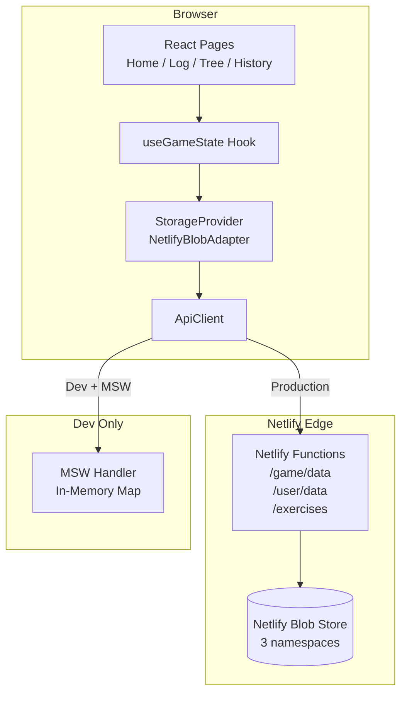
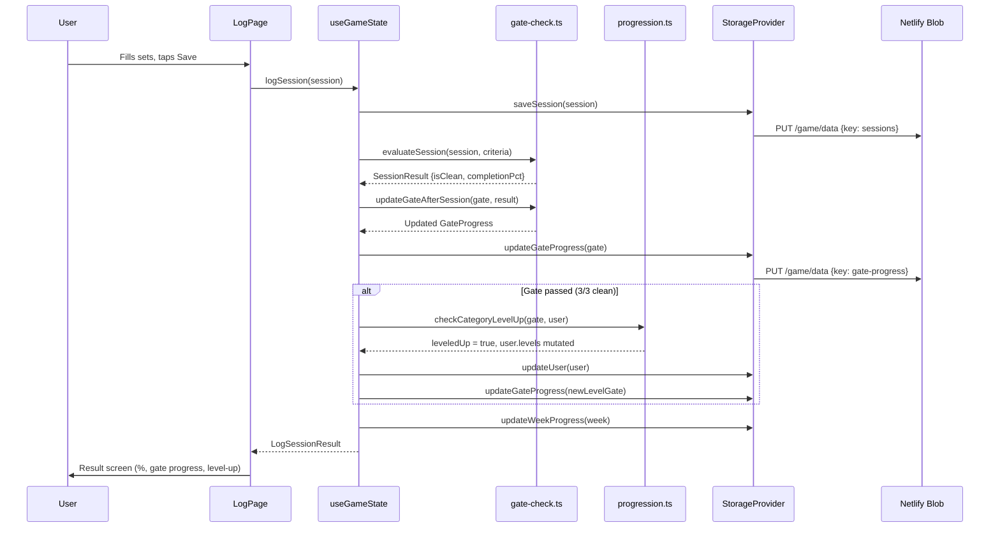
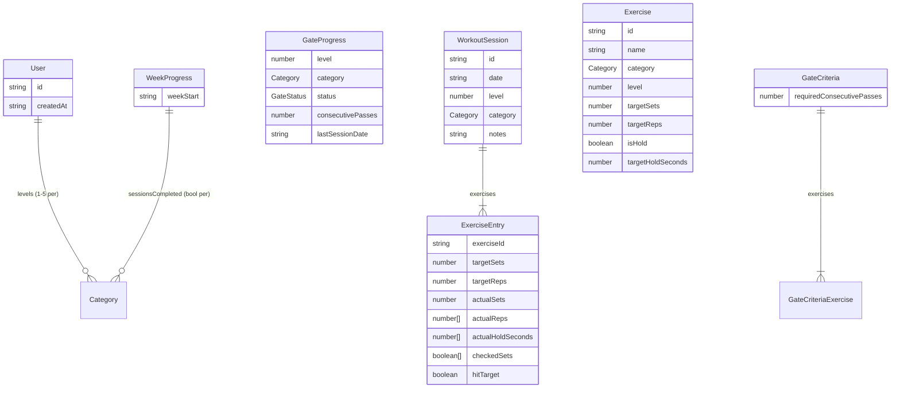

# ARCHITECTURE.md — contrl

## 1. High-Level Overview

**contrl** is a progressive calisthenics tracker that guides users from beginner to expert through structured bodyweight exercises. It organizes training into three independent categories — Push, Pull, Squat — each with five difficulty levels. Advancement is governed by a **gate system**: users must log 3 consecutive "clean" sessions (all exercise targets met) at their current level before unlocking the next.

The core problem it solves: most calisthenics progression systems are either too vague ("do more reps") or too rigid. contrl provides a structured, game-like path where mastery is measured objectively and advancement happens automatically when the user is ready.

---

## 2. Tech Stack

| Layer | Technology | Version |
|-------|-----------|---------|
| Framework | Next.js (App Router) | 14.x |
| Language | TypeScript (strict) | 5.x |
| UI | React | 18.x |
| Styling | Tailwind CSS + custom Tron theme | 3.x |
| Backend | Netlify Functions (serverless) | 2.4 |
| Storage | Netlify Blob Store | 10.5 |
| Dev Mocking | MSW (Mock Service Worker) | 2.12 |
| Testing | Vitest | 4.x |
| Deployment | Netlify (build + edge) | — |
| UI Primitives | Radix UI, clsx, tailwind-merge | — |

No state management library — React hooks only. No ORM — direct blob key-value access.

---

## 3. Directory Structure

```
contrl/
├── netlify/
│   └── functions/                    # Serverless backend
│       ├── core/infrastructure/blob/ # Blob store abstraction (3 stores)
│       ├── user-data.ts              # GET/PUT /user/data
│       ├── user-levels.ts            # GET/PUT /user/levels
│       ├── exercises.ts              # GET/POST /exercises (+ /search, /level, /levels)
│       ├── game-data.ts              # GET/PUT/DELETE /game/data (generic KV)
│       ├── seed.ts                   # POST /seed (dev: populate from fixtures)
│       ├── export.ts                 # GET /export (snapshot blob → JSON)
│       ├── import.ts                 # POST /import (restore from snapshot)
│       └── health.ts                 # GET /health
├── public/
│   ├── manifest.json                 # PWA manifest
│   └── icons/                        # PWA icons (192, 512)
├── src/
│   ├── app/                          # Next.js App Router pages
│   │   ├── layout.tsx                # Root shell: header, BottomNav, MSWProvider
│   │   ├── globals.css               # Tailwind + Tron CSS variables + fonts
│   │   ├── page.tsx                  # Home: weekly dashboard
│   │   ├── log/page.tsx              # Log Workout: 3-phase flow (select → log → result)
│   │   ├── tree/page.tsx             # Skill Tree: 3-column × 5-level grid
│   │   └── history/page.tsx          # History: sessions grouped by week
│   ├── api/                          # REST client layer (PascalCase types)
│   │   ├── client.ts                 # ApiClient class (fetch + timeout)
│   │   ├── exercises.ts              # Exercise endpoints
│   │   ├── user.ts                   # User data endpoints
│   │   └── index.ts                  # Barrel: api.exercises, api.user, api.healthCheck
│   ├── components/
│   │   ├── ui/                       # Design system components
│   │   │   ├── BottomNav.tsx         # Fixed bottom tab navigation (4 tabs)
│   │   │   ├── GlowCard.tsx          # Card with neon glow variants
│   │   │   ├── CategoryBadge.tsx     # Push/Pull/Squat pill badge
│   │   │   ├── NodeBadge.tsx         # Skill tree node (locked/open/in-progress/passed)
│   │   │   ├── ProgressBar.tsx       # Horizontal 0–100% bar
│   │   │   ├── SetCheckbox.tsx       # Per-set completion checkbox (3 visual states)
│   │   │   ├── button.tsx            # Base button (shadcn pattern)
│   │   │   ├── card.tsx              # Base card
│   │   │   ├── badge.tsx             # Base badge
│   │   │   └── index.ts             # Barrel exports
│   │   ├── GatePassedModal.tsx       # Level-up celebration overlay
│   │   ├── SkillTree/               # Legacy skill tree (pre-Phase 1)
│   │   ├── WeeklyTracker/           # Legacy weekly tracker (pre-Phase 1)
│   │   └── WorkoutDetail/           # Legacy workout detail
│   ├── data/
│   │   ├── exercises.json            # 30 exercises (L1–L3, push/pull/squat)
│   │   └── gates.json                # Gate criteria per category × level
│   ├── hooks/
│   │   ├── useGameState.ts           # Primary: game state via StorageProvider
│   │   └── useUserData.ts            # Legacy: API-based state with write queue
│   ├── lib/
│   │   ├── gate-check.ts             # Gate evaluation + update logic
│   │   ├── progression.ts            # Node state derivation + level-up check
│   │   ├── week-progress.ts          # Weekly tracking utilities
│   │   ├── streaks.ts                # Streak calculation
│   │   ├── storage/
│   │   │   ├── provider.ts           # StorageProvider interface
│   │   │   ├── netlify-blob.ts       # NetlifyBlobAdapter implementation
│   │   │   └── index.ts              # Singleton factory (getStorage)
│   │   ├── constants.ts              # App metadata, category colors
│   │   ├── utils.ts                  # cn() class merge utility
│   │   └── __tests__/                # 45 unit tests (4 files)
│   ├── mocks/
│   │   ├── handlers.ts               # MSW request handlers (mirrors all endpoints)
│   │   ├── browser.ts                # MSW browser worker setup
│   │   ├── MSWProvider.tsx            # React provider (conditional init)
│   │   ├── index.tsx                  # Barrel
│   │   └── data/                      # Mock fixtures (exercises, user, levels)
│   └── types/
│       └── index.ts                   # All Phase 0 game types
├── tailwind.config.ts                 # Tron theme: colors, fonts, glows
├── next.config.js                     # Next.js config
├── netlify.toml                       # Build, redirects, headers
├── vitest.config.ts                   # Test config (excluded from Next.js build)
└── tsconfig.json                      # Strict TS, path aliases, vitest excluded
```

---

## 4. System Architecture

### Data Flow Diagram



### Request Lifecycle (Log Workout)



### Two Hook Systems

The codebase has two parallel state management approaches:

| | `useGameState` (Phase 1) | `useUserData` (Legacy) |
|--|---|---|
| Categories | lowercase (`push`, `pull`, `squat`) | PascalCase (`Push`, `Pull`, `Squat`) |
| Storage | `StorageProvider` → `/game/data` | `api.user` → `/user/data` |
| Gate system | Full gate-check integration | Auto-level-up on backend |
| Used by | Home, Log, Tree, History pages | Legacy SkillTree component |

New code should use `useGameState`. The legacy hook remains for backward compatibility with the old SkillTree component.

---

## 5. Key Modules & Components

### Game Logic (`src/lib/`)

| Module | Responsibility | Key Exports |
|--------|---------------|-------------|
| `gate-check.ts` | Evaluate sessions against gate criteria; update pass counter | `getGateCriteria()`, `evaluateSession()`, `updateGateAfterSession()`, `createGateProgress()` |
| `progression.ts` | Derive visual node state; check level advancement | `getNodeState()`, `checkCategoryLevelUp()` |
| `week-progress.ts` | Track weekly category completion | `getWeekStart()`, `createWeekProgress()`, `markCategoryDone()`, `isWeekComplete()`, `needsWeekReset()` |
| `streaks.ts` | Compute consecutive complete weeks | `calculateStreak()`, `updateStreakOnWeekEnd()` |

### Storage (`src/lib/storage/`)

| Module | Responsibility |
|--------|---------------|
| `provider.ts` | `StorageProvider` interface — domain methods for sessions, gates, weeks, user |
| `netlify-blob.ts` | `NetlifyBlobAdapter` — implements provider via `/game/data` key-value API |
| `index.ts` | `getStorage()` singleton factory, `setStorage()` for test overrides |

### State (`src/hooks/`)

| Hook | Responsibility |
|------|---------------|
| `useGameState` | Loads game state on mount, handles week reset, exposes `logSession()` which orchestrates save → evaluate → gate update → level-up → week mark |
| `useUserData` | Legacy API-based state with debounced writes (600ms) and promise-based write queue |

### Backend (`netlify/functions/`)

| Function | Endpoint | Purpose |
|----------|----------|---------|
| `game-data` | `/game/data` | Generic key-value CRUD (primary storage for game state) |
| `user-data` | `/user/data` | Full user data with auto-level-up check |
| `user-levels` | `/user/levels` | Read/write individual category levels |
| `exercises` | `/exercises`, `/exercises/levels`, `/exercises/search`, `/exercises/level` | Exercise catalog + filtering |
| `seed` | `/seed` | Populate blob from fixtures (dev) |
| `export` / `import` | `/export`, `/import` | Snapshot/restore blob data |
| `health` | `/health` | Health check |

---

## 6. Data Models

### Game Types (`src/types/index.ts`)



**Category** = `'push' | 'pull' | 'squat'` (lowercase in game logic, PascalCase in API layer)

**GateStatus** = `'locked' | 'in-progress' | 'passed'`

### Storage Keys (Netlify Blob)

| Key | Shape | Description |
|-----|-------|-------------|
| `sessions` | `WorkoutSession[]` | All logged sessions |
| `gate-progress` | `Record<"category:level", GateProgress>` | Gate state per category × level |
| `week-progress` | `Record<weekStart, WeekProgress>` | Weekly completion per Monday |
| `user` | `User` | User profile + levels |

### Static Data Files

| File | Shape | Description |
|------|-------|-------------|
| `exercises.json` | `Exercise[]` | 30 exercises across L1–L3, 3 categories |
| `gates.json` | `{ [category]: { [level]: GateCriteria } }` | Gate requirements per category × level |

---

## 7. API Surface

### Game Data (Primary — used by `useGameState`)

```
GET    /game/data?key=<key>       → value | null
PUT    /game/data  {key, value}   → {success: true}
DELETE /game/data?key=<key>       → {success: true}
```

### User Data (Legacy — used by `useUserData`)

```
GET    /user/data                 → UserData (with auto-level-up check)
GET    /user/data?category=Push   → UserData (filtered weeklyProgress)
PUT    /user/data  {UserData}     → UserData
GET    /user/levels               → {Push, Pull, Squat}
PUT    /user/levels  {category, level} → {success: true}
```

### Exercises (Legacy — used by old SkillTree)

```
GET    /exercises                 → BaseExercise[]
GET    /exercises?level=1&category=Push → BaseExercise[] (filtered)
GET    /exercises/levels          → WorkoutLevels (all levels + exercises)
GET    /exercises/search?q=push   → BaseExercise[]
GET    /exercises/level?name=...  → {level, name, category}
POST   /exercises  {BaseExercise} → {success, exercise}
```

### Dev/Admin

```
POST   /seed                      → Populate blob from fixtures
GET    /export                    → Full blob snapshot as JSON
POST   /import  {data}            → Restore blob from snapshot
GET    /health                    → {status: 'ok', timestamp, mock}
```

All endpoints return JSON, include CORS headers, and handle OPTIONS preflight.

---

## 8. Configuration & Environment

### Environment Variables

| Variable | Required | Default | Description |
|----------|----------|---------|-------------|
| `NEXT_PUBLIC_MSW_ENABLED` | No | `false` | Enable MSW request interception for dev |
| `NEXT_PUBLIC_API_BASE_URL` | No | `""` | Base URL for API calls (empty = same origin) |
| `NEXT_PUBLIC_API_TIMEOUT` | No | `10000` | API request timeout (ms) |

### Config Files

| File | Purpose |
|------|---------|
| `next.config.js` | Next.js settings (external packages, build checks) |
| `tailwind.config.ts` | Tron design system (colors, fonts, shadows, animations) |
| `tsconfig.json` | Strict TS, path aliases `@/*`, excludes `vitest.config.ts` |
| `.eslintrc.json` | Next.js + TypeScript ESLint (extends `plugin:@typescript-eslint/recommended`) |
| `netlify.toml` | Build command, function directory, redirects (`/api/*` → functions), security headers |
| `vitest.config.ts` | Test runner config with `@` alias (excluded from Next.js tsconfig) |

### Dev Server Modes

| Mode | Command | Ports | MSW | Storage |
|------|---------|-------|-----|---------|
| Next.js only + MSW | `npm run dev` (MSW_ENABLED=true) | 3000 | Active | In-memory |
| Netlify unified | `npm run netlify-dev` | 8888→3000 | Off | Local blob sim |
| Separate servers | `npm run dev` + `netlify functions:serve` | 3000 + 9999 | Off | Local blob sim |

---

## 9. Build, Test & Deploy

### Build

```bash
npm run build          # Next.js production build
npm run netlify-build  # Netlify CI build (same, used by netlify.toml)
```

Build output: `.next/` (static pages + serverless functions) + bundled Netlify Functions.

The ESLint `@typescript-eslint/recommended` config warning is pre-existing and does not block builds.

### Test

```bash
npx vitest run         # 45 tests across 4 files (~300ms)
npx tsc --noEmit       # Type check (0 errors)
```

Test files in `src/lib/__tests__/`:
- `gate-check.test.ts` — 16 tests (clean sessions, below-target, holds, missing exercises)
- `progression.test.ts` — 9 tests (node state derivation, level-up)
- `week-progress.test.ts` — 14 tests (week start calc, category marking, reset detection)
- `streaks.test.ts` — 6 tests (consecutive weeks, broken streaks)

Note: `vitest.config.ts` is excluded from `tsconfig.json` so it doesn't interfere with the Next.js build (vitest is a devDependency not available in CI).

### Deploy

Deploys automatically via Netlify on push to main:
1. `npm run build` compiles Next.js + bundles functions
2. `.next/` published to Netlify edge
3. `netlify/functions/` deployed as serverless functions
4. `/api/*` redirected to `/.netlify/functions/*` via `netlify.toml`

---

## 10. Design Decisions & Trade-offs

### Gate System Over Auto-Level-Up

**Decision:** Require 3 consecutive clean sessions instead of a single passing session.

**Why:** A single good day shouldn't advance a user to harder exercises they can't sustain. The consecutive requirement ensures the user can reliably perform at their level before moving on. The counter resets to 0 on any non-clean session, preventing "lucky" advancement.

### Two Category Case Systems

**Decision:** Lowercase in game logic (`push`), PascalCase in API layer (`Push`).

**Why:** The API layer predates the game logic (Phase 0). The API uses PascalCase categories as established by the existing backend. Rather than migrate the API, the game logic uses its own lowercase convention. Conversion happens at the hook boundary. A future cleanup could standardize.

### StorageProvider Abstraction

**Decision:** Domain-specific interface (`saveSession`, `getGateProgress`) rather than raw key-value.

**Why:** Makes game logic agnostic to storage backend. The current `NetlifyBlobAdapter` can be swapped for LocalStorage, SQLite, or Postgres without changing any game logic or hooks. The adapter handles serialization, key naming, and default values.

### No External State Management

**Decision:** React hooks only — no Redux, Zustand, or Jotai.

**Why:** The app is single-player with relatively simple state. `useGameState` manages game state, `useUserData` manages API state. The data flows are straightforward: load on mount, mutate on action, persist to storage. Adding a state library would be premature abstraction.

### Positive-Only UX

**Decision:** No "FAIL" states, no red indicators for below-target performance. Below-target shown as muted gray (#6b8aab), never red.

**Why:** The app targets beginners building a training habit. Punitive feedback discourages consistency. Progress is shown as percentages and forward-looking language ("1 rep to go") rather than pass/fail binaries.

### MSW for Development

**Decision:** Use Mock Service Worker to intercept fetch requests in the browser, rather than a separate mock server.

**Why:** Enables full frontend development without running the backend. The MSW handlers replicate exact backend behavior (including auto-level-up logic) with in-memory state. Toggle on/off via environment variable. Zero infrastructure overhead.

### Static Exercise Data

**Decision:** Exercises and gate criteria stored as JSON files (`exercises.json`, `gates.json`) imported directly, not fetched from an API.

**Why:** Exercise definitions don't change at runtime. Static imports are faster (bundled at build time), type-safe, and eliminate a network round-trip. The API exercise endpoints exist for the legacy SkillTree component but new code reads directly from JSON.

---

## 11. Known Limitations & TODOs

### Content Gaps

- **Levels 4–5 missing:** `exercises.json` and `gates.json` only cover Levels 1–3. Levels 4 (Advanced) and 5 (Expert) have no exercises or gate criteria. Advancing past L3 will result in empty exercise lists.

### Feature Gaps

- **No authentication:** Single "default" user. No multi-user, no cross-device sync.
- **No offline support:** PWA manifest exists but no service worker is installed (`@serwist/next` is planned but not added). App requires network connectivity.
- **No session editing/deletion:** Once a session is logged, it cannot be modified or removed.
- **No data reset:** No way for a user to clear their progress and start over.
- **No push notifications:** No reminders for incomplete weeks or streak warnings.

### Technical Debt

- **Legacy hook:** `useUserData` and the old SkillTree/WeeklyTracker components remain. New screens use `useGameState` exclusively. The legacy components could be removed once the migration is verified.
- **Auto-level-up in backend:** The `GET /user/data` handler still contains auto-level-up logic (evaluates today's session and advances levels). This conflicts with the Phase 1 gate system. Should be removed per the plan.
- **Error handling in storage:** `NetlifyBlobAdapter` silently returns defaults on fetch errors. No retry, no error propagation to the UI.
- **Double session logging:** Logging the same category twice in one week marks it "done" on first log. Subsequent sessions are saved to history but don't affect weekly progress.
- **Blob read-modify-write:** The storage adapter reads the full collection, mutates in memory, and writes back. This works for single-user but would conflict under concurrent writes.
