# Database Infrastructure Architecture Guide

_A comprehensive learning resource for understanding database design patterns, infrastructure organization, and implementation strategies._

## UML Architecture Diagram

```mermaid
graph TB
    %% Application Layer
    subgraph "Application Layer"
        App[Next.js Application]
        API[API Routes]
        Components[React Components]
    end

    %% Database Infrastructure Layer
    subgraph "Database Infrastructure Layer"
        subgraph "Connection Management"
            Conn[connection.ts<br/>🔌 Database Connection]
        end

        subgraph "Schema Management"
            Schema[schema.sql<br/>📋 DDL Definitions]
            Migrate[migrate.ts<br/>🔄 Schema Deployment]
        end

        subgraph "Data Population"
            SeedMain[seed.ts<br/>🎯 Main Orchestrator]
            SeedEx[seed-exercises.ts<br/>💪 Exercise Data]
            SeedUser[seed-user-progress.ts<br/>👤 User Progress]
        end

        subgraph "Data Access Layer"
            Queries[queries.ts<br/>🔍 Query Helpers]
            TestQ[test-queries.ts<br/>🧪 Query Validation]
        end

        subgraph "Quality Assurance"
            Verify[verify.ts<br/>✅ Data Integrity]
        end
    end

    %% External Systems
    subgraph "External Systems"
        Neon[(Neon PostgreSQL<br/>☁️ Serverless Database)]
        MockData[Mock Data Files<br/>📁 src/data/]
    end

    %% Connections
    App --> API
    API --> Queries
    Components --> Queries

    Queries --> Conn
    SeedMain --> Migrate
    SeedMain --> SeedEx
    SeedMain --> SeedUser
    Migrate --> Schema
    SeedEx --> MockData
    SeedUser --> MockData

    Conn --> Neon
    Migrate --> Neon
    SeedEx --> Neon
    SeedUser --> Neon
    TestQ --> Neon
    Verify --> Neon

    %% Styling
    classDef connection fill:#e1f5fe
    classDef schema fill:#f3e5f5
    classDef seed fill:#e8f5e8
    classDef query fill:#fff3e0
    classDef verify fill:#fce4ec
    classDef external fill:#f5f5f5

    class Conn connection
    class Schema,Migrate schema
    class SeedMain,SeedEx,SeedUser seed
    class Queries,TestQ query
    class Verify verify
    class Neon,MockData external
```



## File Architecture Overview


---

## File-by-File Analysis

### 🔌 `connection.ts` - Database Connection Management

**Purpose:** Establishes and manages the connection to the PostgreSQL database using Neon's serverless driver.

```typescript
// Core responsibility: Database connectivity
export const sql = neon(process.env.DATABASE_URL!);
export async function testConnection() {
  /* ... */
}
```

#### Language-Agnostic Concepts:

- **Connection Pooling**: Manages database connections efficiently
- **Environment Configuration**: Separates configuration from code
- **Connection Validation**: Tests database reachability

#### Design Patterns:

- **Singleton Pattern**: Single connection instance shared across the application
- **Factory Pattern**: Creates and configures database connections
- **Configuration Pattern**: Externalized database settings

#### Impact & Outcomes:

✅ **Performance**: Connection reuse reduces overhead  
✅ **Security**: Environment variables protect credentials  
✅ **Reliability**: Connection testing ensures database availability  
✅ **Scalability**: Serverless architecture handles traffic spikes

---

### 📋 `schema.sql` - Database Schema Definition

**Purpose:** Defines the complete database structure using SQL DDL (Data Definition Language).

```sql
-- Core responsibility: Database structure
CREATE TABLE IF NOT EXISTS users (
  id UUID PRIMARY KEY DEFAULT gen_random_uuid(),
  email VARCHAR(255) UNIQUE NOT NULL,
  -- ...
);
```

#### Language-Agnostic Concepts:

- **Schema Definition**: Blueprint for data storage structure
- **Referential Integrity**: Foreign key constraints maintain data consistency
- **Data Types**: Appropriate column types for different data categories
- **Indexing Strategy**: Performance optimization for common queries

#### Design Patterns:

- **Domain-Driven Design**: Tables represent business entities
- **Normalization**: Reduces data redundancy through proper relationships
- **Constraint-Based Validation**: Database-level data integrity rules

#### Impact & Outcomes:

✅ **Data Integrity**: Constraints prevent invalid data entry  
✅ **Performance**: Indexes optimize query execution  
✅ **Maintainability**: Clear structure aids development  
✅ **Scalability**: Normalized design supports growth

---

### 🔄 `migrate.ts` - Schema Migration Runner

**Purpose:** Executes database schema changes safely and consistently across environments.

```typescript
// Core responsibility: Schema deployment
export async function runMigrations() {
  const schemaContent = await fs.readFile(schemaPath, "utf8");
  await sql.unsafe(schemaContent);
}
```

#### Language-Agnostic Concepts:

- **Database Migrations**: Version-controlled schema changes
- **Idempotent Operations**: Safe to run multiple times
- **Transaction Safety**: All-or-nothing schema updates
- **Environment Consistency**: Same schema across dev/staging/production

#### Design Patterns:

- **Command Pattern**: Encapsulates schema change operations
- **Version Control Pattern**: Tracks schema evolution
- **Rollback Strategy**: Ability to revert changes if needed

#### Impact & Outcomes:

✅ **Reliability**: Consistent database structure across environments  
✅ **Safety**: Atomic transactions prevent partial failures  
✅ **Traceability**: Clear history of schema changes  
✅ **Collaboration**: Team members share same database structure

---

### 🎯 `seed.ts` - Master Data Population Orchestrator

**Purpose:** Coordinates the complete database setup process from schema creation to data population.

```typescript
// Core responsibility: Setup orchestration
async function main() {
  await runMigrations();
  await seedExercises();
  await seedUserProgress();
}
```

#### Language-Agnostic Concepts:

- **Orchestration Pattern**: Coordinates multiple related operations
- **Dependency Management**: Ensures correct execution order
- **Error Handling**: Graceful failure management
- **Setup Automation**: Reduces manual configuration steps

#### Design Patterns:

- **Facade Pattern**: Simplifies complex setup process
- **Template Method Pattern**: Defines setup sequence
- **Composite Pattern**: Combines multiple seeding operations

#### Impact & Outcomes:

✅ **Developer Experience**: One command sets up entire database  
✅ **Consistency**: Same setup process across all environments  
✅ **Efficiency**: Automated process reduces setup time  
✅ **Reliability**: Standardized setup reduces human errors

---

### 💪 `seed-exercises.ts` - Exercise Data Population

**Purpose:** Transforms and loads exercise data from mock files into the database.

```typescript
// Core responsibility: Exercise data migration
export async function seedExercises() {
  for (const exercise of allExercises) {
    const exerciseUuid = randomUUID();
    await sql`INSERT INTO exercises (id, name, ...) VALUES (${exerciseUuid}, ...)`;
  }
}
```

#### Language-Agnostic Concepts:

- **Data Transformation**: Converting between data formats
- **Batch Processing**: Efficient handling of large datasets
- **UUID Generation**: Unique identifier creation
- **Data Mapping**: Transforming source data to target schema

#### Design Patterns:

- **ETL Pattern**: Extract, Transform, Load data pipeline
- **Mapper Pattern**: Converts between data structures
- **Batch Processing Pattern**: Handles data in chunks

#### Impact & Outcomes:

✅ **Data Migration**: Seamlessly moves from mock to real data  
✅ **Performance**: Batch operations optimize database load  
✅ **Integrity**: UUID generation ensures unique records  
✅ **Flexibility**: Easy to modify exercise data structure

---

### 👤 `seed-user-progress.ts` - User Progress Data Population

**Purpose:** Creates initial user accounts and sets up progress tracking data.

```typescript
// Core responsibility: User data initialization
export async function seedUserProgress() {
  const userId = await createOrFindUser();
  await setUserLevels(userId, MOCK_CurrentUserLevel);
}
```

#### Language-Agnostic Concepts:

- **User Account Management**: Creating and managing user entities
- **Initial State Setup**: Establishing baseline user progress
- **Relationship Mapping**: Connecting users to their progress data
- **Default Value Assignment**: Setting reasonable starting points

#### Design Patterns:

- **Factory Pattern**: Creates user entities with proper initialization
- **Builder Pattern**: Constructs complex user state objects
- **Strategy Pattern**: Different initialization strategies for different user types

#### Impact & Outcomes:

✅ **User Onboarding**: New users start with appropriate baseline data  
✅ **Testing**: Consistent test data for development  
✅ **Personalization**: Individual progress tracking per user  
✅ **Scalability**: Foundation for multi-user support

---

### 🔍 `queries.ts` - Data Access Layer

**Purpose:** Provides a clean, typed interface for database operations used throughout the application.

```typescript
// Core responsibility: Data access abstraction
export async function getUserCurrentLevels(userId: string) {
  return await sql`
    SELECT cl.*, wl.name as level_name, ec.name as category_name
    FROM user_current_levels cl
    JOIN workout_levels wl ON cl.workout_level_id = wl.id
    JOIN exercise_categories ec ON cl.category_id = ec.id
    WHERE cl.user_id = ${userId}
  `;
}
```

#### Language-Agnostic Concepts:

- **Data Access Layer**: Abstraction between business logic and database
- **Query Composition**: Building complex queries from simple parts
- **Type Safety**: Ensuring data type consistency
- **Performance Optimization**: Efficient query patterns

#### Design Patterns:

- **Repository Pattern**: Encapsulates data access logic
- **Query Object Pattern**: Represents database queries as objects
- **Data Access Object (DAO)**: Provides interface to database operations

#### Impact & Outcomes:

✅ **Maintainability**: Centralized database access logic  
✅ **Reusability**: Common queries shared across application  
✅ **Performance**: Optimized queries reduce database load  
✅ **Type Safety**: Compile-time error detection

---

### 🧪 `test-queries.ts` - Query Validation & Testing

**Purpose:** Validates that database queries work correctly and return expected data structures.

```typescript
// Core responsibility: Query validation
async function testGetUserCurrentLevels() {
  const levels = await getUserCurrentLevels(testUserId);
  assert(levels.length > 0, "Should return user levels");
  assert(levels[0].level_name, "Should include level name");
}
```

#### Language-Agnostic Concepts:

- **Unit Testing**: Validating individual components work correctly
- **Integration Testing**: Testing database interactions
- **Assertion-Based Testing**: Verifying expected outcomes
- **Test Data Management**: Creating and cleaning test data

#### Design Patterns:

- **Test Fixture Pattern**: Consistent test data setup
- **Assertion Pattern**: Validating expected outcomes
- **Tear-down Pattern**: Cleaning up after tests

#### Impact & Outcomes:

✅ **Quality Assurance**: Ensures queries work as expected  
✅ **Regression Prevention**: Catches breaking changes early  
✅ **Documentation**: Tests serve as usage examples  
✅ **Confidence**: Developers can refactor with assurance

---

### ✅ `verify.ts` - Database Health & Integrity Checker

**Purpose:** Performs comprehensive validation of database setup, data integrity, and system health.

```typescript
// Core responsibility: System validation
export async function verifyDatabaseSetup() {
  await verifyTablesExist();
  await verifyDataIntegrity();
  await verifyIndexes();
  console.log("🎉 Database setup verification completed successfully!");
}
```

#### Language-Agnostic Concepts:

- **Health Checks**: System status validation
- **Data Integrity Verification**: Ensuring data consistency
- **Automated Validation**: Systematic checking of system state
- **Reporting**: Clear feedback on system status

#### Design Patterns:

- **Chain of Responsibility**: Sequential validation steps
- **Observer Pattern**: Reporting validation results
- **Strategy Pattern**: Different validation approaches

#### Impact & Outcomes:

✅ **System Reliability**: Ensures database is properly configured  
✅ **Early Problem Detection**: Identifies issues before they affect users  
✅ **Operational Confidence**: Teams know system status  
✅ **Debugging Aid**: Helps identify root causes of issues

---

## Language-Agnostic Design Patterns Used

### 1. **Repository Pattern**

- **What**: Encapsulates data access logic behind a clean interface
- **Why**: Separates business logic from database implementation details
- **Example**: `queries.ts` provides methods like `getUserCurrentLevels()` without exposing SQL

### 2. **Factory Pattern**

- **What**: Creates objects without specifying their concrete classes
- **Why**: Provides flexibility in object creation and initialization
- **Example**: `connection.ts` creates database connections based on environment

### 3. **Template Method Pattern**

- **What**: Defines algorithm structure, letting subclasses override specific steps
- **Why**: Provides consistent process while allowing customization
- **Example**: `seed.ts` follows a template: migrate → seed exercises → seed users

### 4. **Command Pattern**

- **What**: Encapsulates requests as objects
- **Why**: Allows parameterization, queuing, and logging of requests
- **Example**: Migration scripts as executable commands

### 5. **ETL Pattern (Extract, Transform, Load)**

- **What**: Data processing pipeline pattern
- **Why**: Systematic approach to data migration and transformation
- **Example**: Loading mock data into database with format conversion

## System Architecture Benefits

### 🏗️ **Separation of Concerns**

Each file has a single, well-defined responsibility:

- Connection management ≠ Schema definition ≠ Data access
- Clear boundaries make the system easier to understand and maintain

### 🔒 **Data Integrity**

Multiple layers of validation ensure data quality:

- Database constraints (schema level)
- Application validation (query level)
- Integration testing (test level)

### 🚀 **Scalability Foundation**

Architecture supports growth:

- Connection pooling handles increased traffic
- Normalized schema supports complex queries
- Modular design allows independent scaling

### 🛠️ **Developer Experience**

Well-organized code improves productivity:

- Clear file organization reduces cognitive load
- Automated setup reduces onboarding time
- Comprehensive testing increases confidence

## Performance Considerations

### ⚡ **Query Optimization**

```sql
-- Indexed queries for fast retrieval
CREATE INDEX idx_exercises_level_category ON exercises(level_id, category_id);
```

### 🔄 **Connection Efficiency**

```typescript
// Reusable connection instance
export const sql = neon(process.env.DATABASE_URL!);
```

### 📦 **Batch Operations**

```typescript
// Process multiple records efficiently
for (const exercise of allExercises) {
  await sql`INSERT INTO exercises ...`;
}
```

## Error Handling Strategies

### 🛡️ **Graceful Degradation**

```typescript
try {
  await seedExercises();
  successCount++;
} catch (error) {
  console.error(`Error inserting exercise ${exercise.name}:`, error);
  // Continue with other exercises
}
```

### 🔍 **Comprehensive Logging**

```typescript
console.log("🚀 Starting database setup...");
console.log("✅ Database connected successfully");
console.log(
  `✅ Seeded ${successCount}/${allExercises.length} exercises successfully`,
);
```

### ⚠️ **Validation Checkpoints**

```typescript
if (levels.length === 0) {
  throw new Error(
    "No workout levels found - database may not be properly seeded",
  );
}
```

## Learning Outcomes

After studying this infrastructure, you should understand:

### 🎯 **Core Database Concepts**

- **Schema Design**: How to structure relational data
- **Normalization**: Reducing data redundancy through proper relationships
- **Indexing**: Optimizing query performance
- **Constraints**: Maintaining data integrity

### 🔧 **Implementation Patterns**

- **Migration Strategy**: Safe schema evolution
- **Connection Management**: Efficient database connectivity
- **Data Access Layer**: Clean separation of concerns
- **Testing Strategy**: Ensuring system reliability

### 📈 **Architectural Principles**

- **Single Responsibility**: Each file/function has one job
- **Dependency Injection**: Configuration separated from implementation
- **Error Handling**: Graceful failure management
- **Documentation**: Self-explaining code and comprehensive comments

### 🚀 **Professional Practices**

- **Version Control**: Schema and data changes tracked
- **Environment Management**: Different configs for dev/staging/production
- **Automated Setup**: Reduce manual processes
- **Quality Assurance**: Comprehensive testing and validation

## Next Steps for Learning

### 1. **Study the Code**

- Read each file carefully, understanding its purpose
- Trace the flow from `seed.ts` through the entire setup process
- Experiment with the queries in `queries.ts`

### 2. **Hands-On Practice**

- Run `npm run db:setup` to see the system in action
- Modify some exercise data and re-run seeding
- Write your own query functions in `queries.ts`

### 3. **Expand Understanding**

- Learn about PostgreSQL advanced features
- Study database performance optimization
- Explore different migration strategies

### 4. **Apply Patterns**

- Implement similar patterns in other projects
- Consider how these patterns apply to different databases
- Think about how to test database interactions

## Recommended Reading

- **Database Design**: "Database Design for Mere Mortals" by Michael J. Hernandez
- **SQL Mastery**: "Learning SQL" by Alan Beaulieu
- **Architecture Patterns**: "Patterns of Enterprise Application Architecture" by Martin Fowler
- **PostgreSQL**: "PostgreSQL: Up and Running" by Regina Obe

---

_This infrastructure serves as a foundation for understanding professional database design patterns, data management strategies, and architectural principles that scale from personal projects to enterprise applications._
